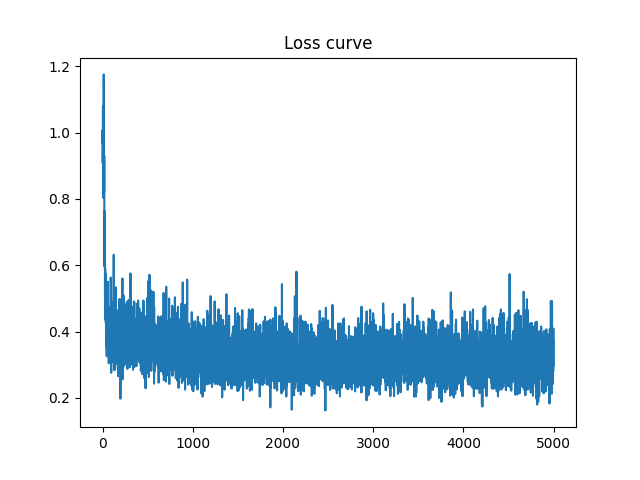
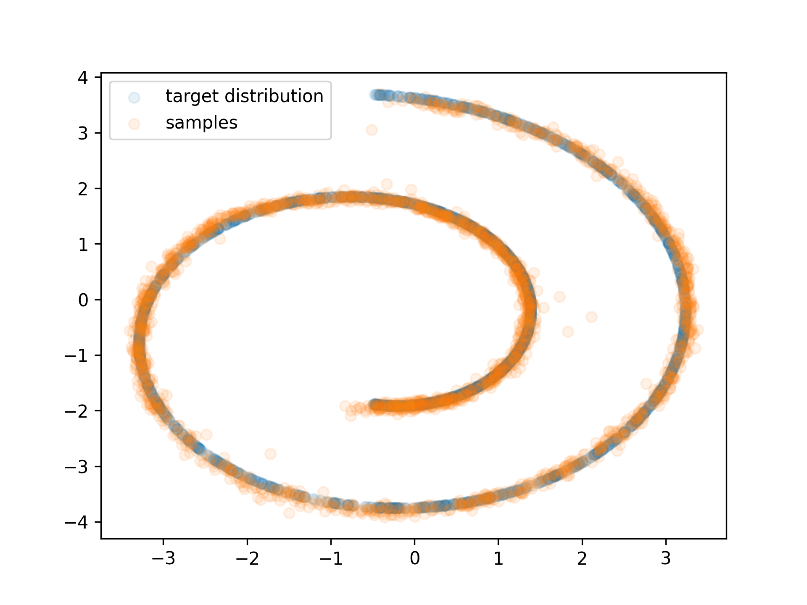
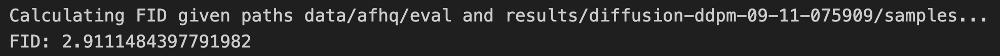

# Assigment 1

by Kasper Joergensen (studentID: 20246358)

# Task 1: 2D Plot Diffusion

Below I show the loss curve together with samples from the 2D distribution drawn through the trained DDPM model. The samples seem good and have a Chamfer Distance of 11.5. On repeated training runs I saw Chamfer Distance between 8 and 19.

  

    
  

  

    
  

  

    
  

# Task 2: Image Diffusion

Below, I show 8 generated samples from my trained DDPM model. We can see that the generated images seem quite realistic, which is confirmed by a very low FID score of 3.

  

    
  

  
  

    
  

  

    
  

  

    
  

  
  

    
  

  

    
  

  

    
  

  

    
  

  

    
  

